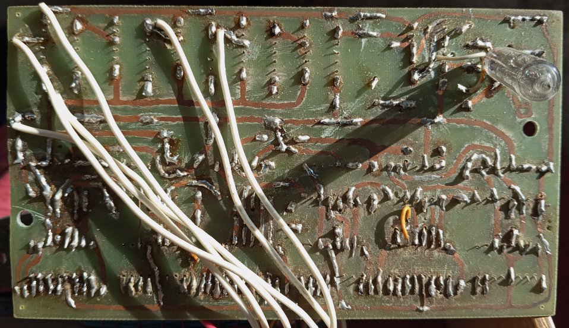
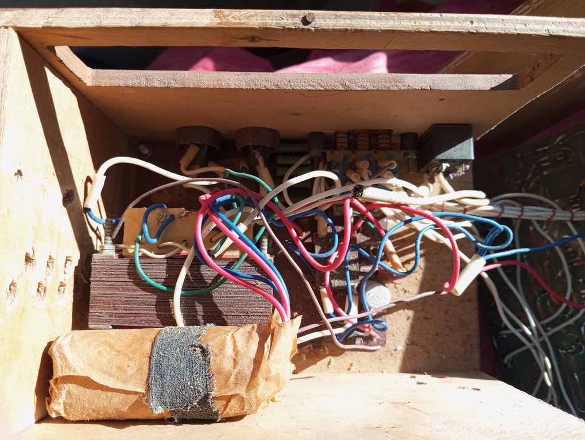

> Dedicated to my father.

# Introduction

This is my Mona Lisa, built in Lithuania around 1992, could have been the USSR of late 1980s. I was around 14, making my own digital clock, guided by my father.

One does not often get to see unique things that have a purpose. Here is one:

<table>
<tr>
<th style="text-align:center"> A Home-Made Digital K155 Clock</th>
</tr>
<tr>
<td>

</td>
</tr>
</table>

It was based on the Soviet TTL K155-series microchips, with gas discharge displays. The whole thing consumed electricity like a heater. 

The electric circuit diagram seems to be lost. ChatGPT does provide some strong clues where to look for, which is surprising considering old Soviet books which do not exist online. Unfortunately, the whole Technology Library of Lithuania is gone now. 

# Historical Context

Personal computers were very rare at the time in Lithuania. My secondary school "information technology" class taught us how to use [ChiWriter](https://en.wikipedia.org/wiki/ChiWriter) which must have run on [Robotron](https://en.wikipedia.org/wiki/VEB_Robotron), a DOS-compatible East Germany-made personal computer. Computers were an optional once-a-week matter, most of the lessons went on with paper and pencil about Claude Shannon and Boolean algebra. We did not have access to the design of PCBs with say, P-CAD and automated printers. The circuit board design was completely hand-drawn.

# Circuit Board Printing

We used a single copper (Cu) plated board, the routes were drawn with a nail polish followed by the board immersion into some chemical liquid compound. This was very rough and tedious, needless to say.

At first, we applied ferric chloride (Fe2Cl3) to etch the circuit routes, but our solution was not effective and we would wait for days if not weeks for the irrelevant Cu-parts to disappear from the board's surface. A slight warming or periodic movement would not speed a chemical reaction much. The designs were flawed in that there was so much copper to remove.

Once, after losing patience of watching over a never ending reaction, I decided to pour hydrochloric acid HCl on some metal shavings in a big plastic can used for sardines, to get a "stronger ferric chloride". **Do not do this at home. I nearly lost my lungs.**

At some point we started using cupric sulfate CuSO4. This was faster, but not by much. Years later I would also see my uncle use cupric sulfate to paint the trunks of the apple trees...

We also resorted to electrolysis. The painted board is immersed into a salted water inside an iron can. I believe the cathode is attached to the can and the anode is immersed into the water in an isolated manner (by sticking it into a hole drilled in a plastic cover on top of the can to avoid a short-circuit). This would remove copper so rapidly, but the nail polish would not protect the routes well. The printed routes were never of high quality.

# ACDC

At the time it was common to build voltage transformers manually. We had a lot of varnished copper wire of old circuit relays floating around. The formula was surprisingly simple: 

The number of windings to get one volt  = 50/S, where S was an effective area of a ferrite core entering the transformer's casing, in squared centimeters.

This would work for a vast range of transformer and wire sizes. Consider an exercise to derive this formula from Maxwell's equations...

The process of hand rolling a transformer was an exercise of patience as thousands of windings were needed and a ferrite core consisted of many sheets that had to be assembled one by one. I would place some markings on paper in order not to get lost at counting. This was so tiresome that once I even confused primary and secondary windings when connecting the transformer to the voltage source after the assembly. Puff, and the whole evening's work was gone. 

This magic was insufficient for small transformers. A small transformer size would demand a very thin copper wire due to size limitations, and often the electric current would come out too weak. It would not drive, say, a neighbour's portable cassette Sony Walkman used as a stationary desktop cassette player ;).

# Photos

<table>
<tr>
<th style="text-align:center"> Inside the Box</th>
</tr>
<tr>
<td>

</td>
</tr>
</table>

<table>
<tr>
<th style="text-align:center"> Circuit Board: Top</th>
</tr>
<tr>
<td>

</td>
</tr>
</table>

<table>
<tr>
<th style="text-align:center"> Circuit Board: Bottom</th>
</tr>
<tr>
<td>

</td>
</tr>
</table>

<table>
<tr>
<th style="text-align:center"> Voltage Transformer</th>
</tr>
<tr>
<td>

</td>
</tr>
</table>

<table>
<tr>
<th style="text-align:center"> Gas Discharge Displays</th>
</tr>
<tr>
<td>

</td>
</tr>
</table>

